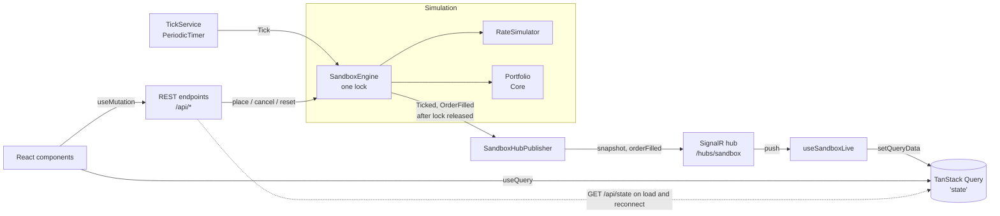

# FX Sandbox

A small trading sandbox. You place limit orders on three simulated currency pairs, a random-walk rate feed moves the market, and orders fill when the rate reaches their limit. A React UI shows live rates, the order book, open positions and unrealised P&L.

## Overview

The requirements, in my own words:

- A trader starts with USD 10,000 of capital.
- They can place buy and sell limit orders on USD/EUR, USD/GBP and USD/CHF.
- Each pair has a simulated spot rate. Every tick it moves by a random step of up to ±0.1% (`newRate = oldRate × (1 + Δ)`, `Δ ∈ [-0.001, +0.001]`), starting from a realistic current rate.
- When the rate reaches an order's limit price, the order fills and creates or adjusts a position.
- The UI shows the order book, the open positions, and unrealised P&L against the latest rates, updating live.
- The backend is ASP.NET Core with a React front end.

## Running it

Prerequisites:

- .NET 10 SDK
- Node.js and npm (a current LTS release; the UI uses Vite 8 and TypeScript 6)

Start the API (from the repo root). It listens on `http://localhost:5290`:

```
dotnet run --project src/FxSandbox.Api --launch-profile http
```

Start the UI in a second terminal:

```
cd src/fx-sandbox-ui
npm install
npm run dev
```

Open **http://localhost:5173**. The Vite dev server proxies `/api` and `/hubs` to the API, so the browser only sees one origin. Start the API first, although the UI reconnects on its own if it starts later.

State is in memory. Restarting the API, or `POST /api/reset`, returns to USD 10,000 with no orders.

Seed rates and the tick interval (1 second) are in `src/FxSandbox.Api/appsettings.json` under `Simulation`. The seed rates are the 2 Oct 2026 closes (USD/EUR 0.8885, USD/GBP 0.7552, USD/CHF 0.8288). They are configuration, and the app does not call a live FX feed.

## Tests

Backend, from the repo root:

```
dotnet test
dotnet test --filter "FullyQualifiedName~ClassName.MethodName"   # a single test
```

There is one xUnit project per source project. Core covers the fill rule, netting, P&L and the capital check. Simulation covers rate bounds, determinism and a concurrency stress test. Api covers the endpoints (via `WebApplicationFactory`) and the SignalR hub.

UI, from `src/fx-sandbox-ui`:

```
npm run build     # tsc -b && vite build
npm run lint
npm run format
```

The UI has no automated test runner. It is checked through the build, lint and typecheck, plus manual testing.

Manual API script: `src/FxSandbox.Api/FxSandbox.Api.http` runs against the API on port 5290 (VS Code REST Client or JetBrains HTTP client). It covers, in order: reset, state, a marketable buy, a far-off sell, cancel (success, 409, 404), a flip to short, the exposure limit (400), validation errors (400), an order that fills on a later tick, and reset. Each step says what to expect.

## Architecture

Projects:

| Project | Role |
| --- | --- |
| `src/FxSandbox.Core` | Pure domain: `Pair`, `Side`, `Order`, `Position`, `Rate`, `FillRule`, and the single-threaded `Portfolio` (place, cancel, fill, netting, mark-to-market) producing immutable snapshots. No I/O. |
| `src/FxSandbox.Simulation` | `RateSimulator` (random walk, injectable `Random`), `SandboxEngine` (wraps `Portfolio` and the simulator under one lock and raises events), `TickService` (`PeriodicTimer` background service). |
| `src/FxSandbox.Api` | ASP.NET Core minimal API host: REST endpoints, the SignalR hub and the publisher that forwards engine events to it, DTOs. |
| `src/fx-sandbox-ui` | React 19, TypeScript, Vite, Tailwind 4, shadcn/ui (Base UI), TanStack Query, SignalR client. |
| `tests/` | xUnit tests, one project per source project. |

REST endpoints: `GET /api/state`, `POST /api/orders`, `DELETE /api/orders/{id}`, `POST /api/reset`. The hub is at `/hubs/sandbox`.

**Request flow.** An endpoint validates the input and calls `SandboxEngine`. The engine takes its lock and asks `Portfolio` to place or cancel. A marketable order fills inside the same call. The engine releases the lock, then raises events. Failures map to ProblemDetails: 400 for validation and rejected orders, 404 for an unknown order, 409 for cancelling an order that is no longer pending.

**Tick flow.** `TickService` calls `SandboxEngine.Tick()` every interval. Under the lock the engine advances every pair's rate, fills each pending order the new rate crosses, and marks the portfolio. After releasing the lock it raises `Ticked` and `OrderFilled`. The `SandboxHubPublisher` sends a full `snapshot` to all clients, plus a discrete `orderFilled` for each fill.

**Live data in the UI.** The server is the source of truth, and the UI holds no business state. `useSandboxState` is a TanStack Query on `['state']`. `useSandboxLive` owns the single SignalR connection and writes each pushed snapshot into that cache with `setQueryData`. It refetches after connecting and reconnecting, because the hub sends nothing on connect. `orderFilled` events raise toasts. Mutations (place, cancel) invalidate the query.



## Decisions and assumptions

- **ASP.NET Core instead of Nancy.** The brief mentions Nancy. It is unmaintained and awkward on .NET 10 with SignalR, so I used ASP.NET Core minimal APIs, which is what the scaffold already used.
- **USD-base quoting.** Pairs are quoted as units of the quote currency per 1 USD (USD/EUR 0.8885). Quantity is a USD notional. Buy means buy USD, and Sell means sell USD. A buy fills when the rate falls to the limit or lower, a sell when it rises to the limit or higher, and a rate equal to the limit fills.
- **Margin-style capital and exposure check.** Placing an order reserves no cash and a fill does not debit cash. Cash changes only through realised P&L, and equity is cash plus unrealised P&L. An order is rejected if its notional plus open-position notional plus pending-order notional would exceed equity.
- **Netting and flips.** There is one net position per pair, with a signed quantity and a weighted-average entry. Shorts are allowed. An opposite fill reduces, closes or flips the position. Realised P&L goes into cash, and a flip reopens the remainder at the fill price. P&L is converted to USD at the current rate: `qty × (1 − entry / rate)`.
- **Marketable orders fill at market.** An order that is already marketable when placed fills immediately at the current rate, not at its limit. An order that rests fills on a later tick at its limit price. That is a simplification, because the rate may have moved slightly past the limit within the tick. The fill toast shows the limit price, so it is not exact for orders that filled at market on placement.
- **Precision.** Rates are rounded to 5 decimal places after each step (to even). Money in API responses is rounded to 2 decimal places. All maths uses `decimal`.
- **% change is over the sparkline window.** The ticker's % change and colour are relative to the oldest of the last ~60 ticks, not a daily open.
- **In-memory state.** One anonymous user, with no authentication or persistence.
- **A single lock.** `Portfolio` and `RateSimulator` are single-threaded. `SandboxEngine` serialises place, cancel and tick under one lock, so an order cannot fill twice or fill and cancel at once, and each tick sees a consistent order set. The operations are tiny and in-memory, so contention is negligible. Events are raised after the lock is released so subscribers cannot deadlock. A channel-based actor was considered and rejected as overkill.

More detail on each slice is in `docs/design-notes.md`, and `PLAN.md` has the slice plan.

## How I used Claude Code

- **Plan mode, then `PLAN.md`.** I started in plan mode, agreed the design decisions (quoting, capital, netting, fill price, concurrency), and saved the result as `PLAN.md`: thirteen slices, backend first, then UI. Each slice has a checkbox that I tick after reviewing it.
- **One slice at a time, one commit per slice.** Claude Code implements a single slice, I review and run it, and I make the commit. Each slice builds and passes its tests first.
- **`CLAUDE.md` conventions.** It records the commands, the layout and the rules: immutable records, pure static domain logic, interfaces only at real seams, `decimal` for money, tests alongside the code, only the dependencies a slice needs, Base UI rather than Radix, and no commits by Claude.
- **A `/git-commit` command.** `.claude/commands/git-commit.md` turns the staged diff into a commit message in a fixed format, with a limited set of emoji prefixes and an explanation of why the change was made.
- **Issues found by manual testing and fixed.** Running the app and the `.http` script found real problems that the unit tests had not. Marketable orders were filling at their limit rather than the market price, so the API now fills them at market and rounds money to cents. The order form's placeholder values were being mistaken for real values, so the form now has real defaults. A per-tick colour flash on the tickers did not match the prototype, so it was removed. StrictMode's double mount was logging a SignalR negotiation error, which is fixed by deferring the first connection start by one tick.

## Limitations and next steps

- State is in memory, with a single user and no authentication, so a restart loses everything.
- Resting orders fill at their limit, not at the rate that crossed it. There is no slippage, spread, fee or partial fill.
- There is no live FX feed. The rates are a random walk from fixed seeds.
- The UI has no automated tests, and the API types in `lib/api.ts` are hand-written and can drift. Generating them from the OpenAPI document is a possible next step.
- The sparkline history is about 60 ticks and is lost on restart.
- The optional price chart for the selected pair, with a line at each pending limit, is deferred (slice 11).
- Still to do (slice 13): a dark mode toggle, loading, empty and error states, an accessibility pass and the page title.
- The dev setup relies on the Vite proxy. A production deployment would need the same routing for `/api` and `/hubs`.
